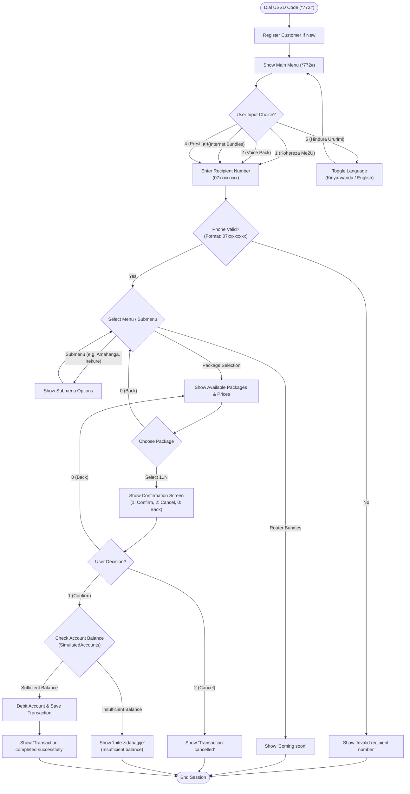

# MTN Rwanda USSD (*772#) Microservices API

A multi-module Spring Boot USSD Gateway and Management system simulating MTN Rwanda's `*772#` USSD menu service.

---

## 🏛️ System Architecture

The project is structured as a **Microservices Architecture** using Kotlin and Spring Boot:

```
                  ┌──────────────────────────────┐
                  │    USSD Client / Postman     │
                  └──────────────┬───────────────┘
                                 │ HTTP POST /ussd (Port 8081)
                                 ▼
                 ┌────────────────────────────────┐
                 │     ussd-gateway-service       │
                 │          (Port 8081)           │
                 └───────────┬────────┬───────────┘
                             │        │
         GET /api/public/... │        │ POST /api/transactions/process
         (Port 8083)         │        │ (Port 8082)
                             ▼        ▼
┌──────────────────────────────┐  ┌──────────────────────────────────┐
│        admin-service         │  │   customer-transaction-service   │
│         (Port 8083)          │  │           (Port 8082)            │
│  (Menus & Packages Management│  │  (Customers, Balance & Tx Logic) │
└──────────────┬───────────────┘  └────────────────┬─────────────────┘
               │                                   │
               ▼                                   ▼
      MySQL (ussd_admin_db)               MySQL (ussd772 / customertx)
```

1. **`ussd-gateway-service` (Port 8081)**: Entry point for USSD sessions. Handles session state, input parsing, language preferences, and menu orchestration.
2. **`admin-service` (Port 8083)**: Manages dynamic USSD menu hierarchies, package definitions, and seeds initial data.
3. **`customer-transaction-service` (Port 8082)**: Manages customer registration, account balances, and processes bundle/airtime transactions.

---

## 📱 Complete USSD User Flows (`*772#`)

### 📊 USSD Flowchart Diagram



### 1. Main Menu Overview
When a user dials `*772#` (HTTP POST `/ussd` with `requestId=1`), the system presents the Main Menu:

```text
CON 1) Kohereza Me2U
2) Voice pack
3) Bundle za Internet
4) Prestige
5) Hindura Ururimi
```

*(If Language is set to English):*
```text
CON 1) Send Me2U
2) Voice pack
3) Internet bundles
4) Prestige
5) Change Language
```

---

### 2. Flow 1: Kohereza Me2U (Send Airtime)
```
[Start *772#] ──> Select 1 (Me2U)
                   │
                   ▼
         [Enter Recipient Number] ──> (e.g. 0790233199)
                   │
                   ▼
         [Select Airtime Amount]
         1) 500Frw
         2) 1,000Frw
         3) 2,000Frw
         4) 3,000Frw
         0) Gusubira Inyuma (Back)
                   │
                   ▼
         [Confirmation Screen]
         Yello, Wohereje inite za 500RWF kuri numero 0790233199
         1) Emeza (Confirm)
         2) Kuvamo (Cancel)
         0) Gusubira Inyuma (Back)
                   │
                   ├──> Select 1: Deducts Balance & Saves Tx ──> "Yello, Wohereje inite za 500RWF byagenze neza..." (END)
                   └──> Select 2: Cancels ──> "Igikorwa cyahagaritswe." (END)
```

---

### 3. Flow 2: Voice Pack (Voice Bundles)
```
[Start *772#] ──> Select 2 (Voice pack)
                   │
                   ▼
         [Enter Recipient Number] ──> (e.g. 078XXXXXXX)
                   │
                   ▼
         [Voice Menu Options]
         1) Gumamo
         2) MTN Irekure 24hrs
         3) MTN Irekure Icyumweru (Weekly)
         4) MTN Irekure Ukwezi (Monthly)
         5) Gwamon'
         6) Amahanga (International) ──> Select: 1) Umunsi | 2) Icyumweru | 3) Ukwezi
         7) DesaDe
         8) FoLeva
         0) Gusubira Inyuma (Back)
                   │
                   ▼
         [Select Package] ──> [Confirm / Cancel] ──> [Transaction Executed]
```

---

### 4. Flow 3: Bundle za Internet (Internet Data Bundles)
```
[Start *772#] ──> Select 3 (Bundle za Internet)
                   │
                   ▼
         [Enter Recipient Number]
                   │
                   ▼
         [Internet Menu Options]
         1) Tubitayeho
         2) Internet Irekure ──────────> Select: 1) Umunsi | 2) Icyumweru | 3) Ukwezi
         3) Gwamon'
         4) FoLeva
         5) Bundle za Social Media ────> Select: 1) Whatsapp | 2) Facebook na Instagram
         6) Router Bundles ───────────> "MTN Rwandacell Message: Coming soon" (END)
         0) Gusubira Inyuma (Back)
                   │
                   ▼
         [Select Package] ──> [Confirm / Cancel] ──> [Transaction Executed]
```

---

### 5. Flow 4: Prestige
```
[Start *772#] ──> Select 4 (Prestige)
                   │
                   ▼
         [Enter Recipient Number]
                   │
                   ▼
         [Prestige Package Options]
         1) 5000Rwf=1000Mins+10GB/30days
         2) 10000Rwf=2500Mins+25GB/30days
         3) 20000Rwf=3000Mins+75GB/30days
         4) 50000Rwf=10000Mins+225GB/30days
         0) Gusubira Inyuma (Back)
                   │
                   ▼
         [Confirm / Cancel] ──> [Transaction Executed]
```

---

### 6. Flow 5: Hindura Ururimi (Change Language)
```
[Start *772#] ──> Select 5 (Hindura Ururimi)
                   │
                   ▼
         Language toggled to English ('en')
         Returns Main Menu in English automatically.
```

---

## 🛠️ Testing via Postman / HTTP Client

### 1. New Session (Dial `*772#`)
* **URL:** `POST http://localhost:8081/ussd`
* **Body (`x-www-form-urlencoded`):**
  * `requestId`: `1`
  * `sessionId`: `sess_001`
  * `serviceCode`: `*772#`
  * `phoneNumber`: `0790233199`
  * `text`: ``

### 2. Next Input Steps (Select Menu / Enter Details)
* **URL:** `POST http://localhost:8081/ussd`
* **Body (`x-www-form-urlencoded`):**
  * `requestId`: `0`
  * `sessionId`: `sess_001`
  * `serviceCode`: `*772#`
  * `phoneNumber`: `0790233199`
  * `text`: `1*0790233199*1*1` *(Or step-by-step: `1`, then `0790233199`, then `1`, then `1`)*

---

## 🚀 Running the Microservices

1. **Start Admin Service:**
   ```powershell
   ./gradlew :admin-service:bootRun
   ```

2. **Start Customer Transaction Service:**
   ```powershell
   ./gradlew :customer-transaction-service:bootRun
   ```

3. **Start USSD Gateway Service:**
   ```powershell
   ./gradlew :ussd-gateway-service:bootRun
   ```
